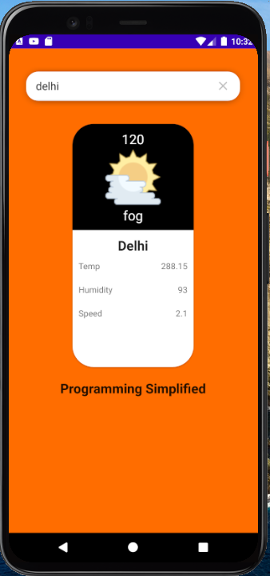

# Weather Android App

## Overview

This is a simple weather application built using Kotlin. It fetches weather data from the OpenWeather API using Retrofit for network requests and displays the data using XML layouts.

## Features

- Fetches current weather data from the OpenWeather API
- Displays weather information including temperature, humidity, and weather conditions
- User-friendly interface with intuitive design

## Screenshots

## Prerequisites

- Android Studio
- Kotlin
- OpenWeather API Key

